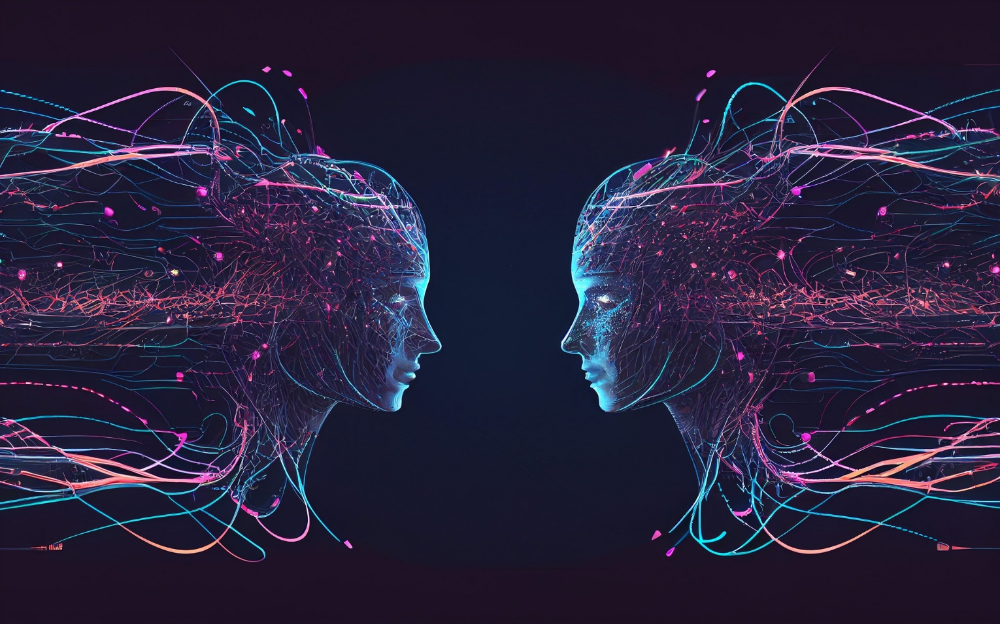

# **Building Applications Using Gen AI**

## Section 1. Building Systems with the ChatGPT API

Welcome to learn to an applications systems using the ChatGPT API.

In this section, I will present you with best practices for building a
complex application

using an LLM.

We used the running example of building an end-to-end customer service
assistant system that chains multiple calls to a language model, using
different instructions depending on the output of the previous call, and
sometimes even looking things up from external sources.

So for example, given a user input like,

"Tell me about what TVs are for sale?", we'd use the following steps to
process this.

First, you can evaluate the input to make sure it doesn't contain any
problematic content, such as hateful speech. Next, the system will
process the input. It will identify what type of query this is. Is it a
complaint or a product information request and so on? Once it has
established that it is a product inquiry, it will retrieve the relevant
information about TVs and use a language model to write a helpful
response.

Finally, you'll check the output to make sure it isn't problematic, such
as inaccurate or inappropriate answers. One theme you see throughout
this course is that an application often needs multiple internal steps
that are invisible to the end-user.

You often want to sequentially process the user input in multiple steps
to get to the final output that is then shown to the user. And as you
build complex systems using LLMs, over the long term you often want to
also keep on improving the system. So I'll also share with you what the
process of developing an LLM-based application feels like, and some best
practices for evaluating and improving a system over time.

Let's dive in!
